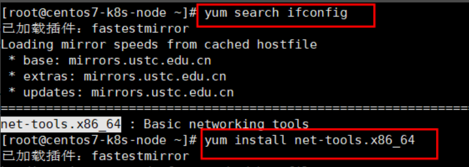

## Centos7基础环境

1. #### vim安装 

   ```
   yum install vim -y
   ```

   

2. ####  ifconfig安装 

   ```
   yum search ifconfig
   yum install net-tools.x86_64
   ```

   

3. #### rz安装 

   ```
   yum install lrzsz -y
   ```

4. #### yum