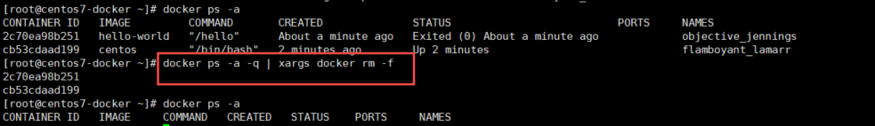

##   Docker安装

#### 一.前提说明 

##### 1.Centos Docker安装 

Docker支持以下的CentOS版本：

CentOS 7 (64-bit)

CentOS 6.5 (64-bit) 或更高的版本

##### 2.前提条件 

目前，CentOS 仅发行版本中的内核支持 Docker。

Docker 运行在 CentOS 7 上，要求系统为64位、系统内核版本为 3.10 以上。

Docker 运行在 CentOS-6.5 或更高的版本的 CentOS 上，要求系统为64位、系统内核版本为 2.6.32-431 或者更高版本。

##### 3.查看自己内核 

uname命令用于打印当前系统相关信息（内核版本号、硬件架构、主机名称和操作系统类型等）。

```
uname -r
```


##### 4.查看已安装的Centos版本信息（Centos6.8有，Centos7无该命令） 

```
lsb_release -a
```


```
cat /etc/redhat-release 
```


#### 二.Docker的基本组成

##### 1镜像（image） 

Docker 镜像（Image）就是一个**只读**的模板。镜像可以用来创建 Docker 容器，一个镜像可以创建很多容器。


##### 2.容器(container) 

Docker 利用容器（Container）独立运行的一个或一组应用。**容器是用镜像创建的运行实例**。

 它可以被启动、开始、停止、删除。每个容器都是相互隔离的、保证安全的平台。

**可以把容器看做是一个简易版的 Linux 环境**（包括root用户权限、进程空间、用户空间和网络空间等）和运行在其中的应用程序。

容器的定义和镜像几乎一模一样，也是一堆层的统一视角，唯一区别在于容器的最上面那一层是可读可写的。


##### 3.仓库(repository) 

仓库（Repository）是**集中存放镜像**文件的场所。

仓库(Repository)和仓库注册服务器（Registry）是有区别的。仓库注册服务器上往往存放着多个仓库，每个仓库中又包含了多个镜像，每个镜像有不同的标签（tag）。

仓库分为公开仓库（Public）和私有仓库（Private）两种形式。

最大的公开仓库是 [Docker Hub](https://hub.docker.com/)。

存放了数量庞大的镜像供用户下载。国内的公开仓库包括阿里云 、网易云 等

docker 架构图


#### 三.安装步骤(Centos7安装Docker)

##### 1. 官网安装参考手册

[Centos 安装 Docker] (https://docs.docker.com/engine/install/centos/) 


##### 2. 确定Centos7以及以上版本


 

##### 3.yum安装gcc相关

```
yum -y install gcc
yum -y install gcc-c++
```

##### 4.卸载旧版本


```
 yum remove docker \
                  docker-client \
                  docker-client-latest \
                  docker-common \
                  docker-latest \
                  docker-latest-logrotate \
                  docker-logrotate \
                  docker-engine
```


##### 5.安装需要的软件包

```
yum install -y yum-utils
```


##### 6.设置stable镜像仓库

```
yum-config-manager --add-repo http://mirrors.aliyun.com/docker-ce/linux/centos/docker-ce.repo
```


##### 7.更新yum软件包索引

```
yum makecache fast
```


##### 8.安装DOCER CE

```
yum -y install docker-ce
```

一段时间执行结束后


##### 9.启动docker

```
systemctl start docker
```


##### 10.测试

```
docker version
```


```
docker run hello-world
```


##### 11.配置镜像加速 

#####  [阿里云镜像加速](https://cr.console.aliyun.com/cn-beijing/instances/mirrors)：


配置镜像加速器：

```
mkdir -p /etc/docker
tee /etc/docker/daemon.json <<-'EOF'
{
  "registry-mirrors": ["https://xxxx.mirror.aliyuncs.com"]
}
EOF
systemctl daemon-reload
systemctl restart docker
```

**注意   "registry-mirrors": ["https://xxxx.mirror.aliyuncs.com"] 替换为自己阿里云上面的地址**

测试是否配置成功

```
docker info
```


##### 12.卸载操作

```
systemctl stop docker
yum -y remove docker-ce
rm -rf /var/lib/docker
```


#### 四.测试HelloWorld

```
docker run hello-world
```

分析run 干了什么


#### 五 Docker命令

###### 5.1帮助命令

```
docker version
```

```
docker info
```

```
docker --help
```


###### 5.2镜像命令

###### 

```
docker images	
```


```
docker search xxx
```


```
docker pull xxx
```


```
docker rmi xxx
```

删除单个


删除多个


删除全部

```
docker rmi -f $(docker images -qa)
```


###### 5.3容器命令


新建并启动容器

```
docker run -it centos /bin/bash
```


启动守护式容器

```
docker run -d 容器名
```


查看启动容器

```
docker ps
```


```
docker ps --help
```


退出容器两种方式

```
exit  #容器停止退出
```

```
ctrl+P+Q   #容器不停止退出
```


停止容器

```
docker stop xxx
```


启动容器

```
docker start xxx
```


重启容器

```
docker restart xxxx
```


强制停止容器

```
docker kill xxx
```


删除容器

​	删除单个

```
docker rm xxx
```


​	删除多个

```
docker rm -f $(docker ps -a -q)
```


或者

```
docker ps -a -q | xargs docker rm -f
```




查看容器日志

```
docker logs -f -t --tail 容器ID
```


```
docker logs --help
```


查看容器内运行的进程

```
docker top xxx
```


查看容器内部细节

```
docker inspect 
```


进入正在运行的容器并且以命令行交互

```
docker exec -it xxxx /bin/bash     ##在容器里面打开新的终端，并且可以启动新的进程
```


```
docker attach xxxx     ##直接进入容器启动命令的终端，不会启动新的进程
```


从容器内拷贝文件到主机上


从主机拷贝到容器内


###### 5.4 总结 


```
attach    Attach to a running container                 # 当前 shell 下 attach 连接指定运行镜像

build     Build an image from a Dockerfile              # 通过 Dockerfile 定制镜像

commit    Create a new image from a container changes   # 提交当前容器为新的镜像

cp        Copy files/folders from the containers filesystem to the host path   #从容器中拷贝指定文件或者目录到宿主机中

create    Create a new container                        # 创建一个新的容器，同 run，但不启动容器

diff      Inspect changes on a container's filesystem   # 查看 docker 容器变化

events    Get real time events from the server          # 从 docker 服务获取容器实时事件

exec      Run a command in an existing container        # 在已存在的容器上运行命令

export    Stream the contents of a container as a tar archive   # 导出容器的内容流作为一个 tar 归档文件[对应 import ]

history   Show the history of an image                  # 展示一个镜像形成历史

images    List images                                   # 列出系统当前镜像

import    Create a new filesystem image from the contents of a tarball # 从tar包中的内容创建一个新的文件系统映像[对应export]

info      Display system-wide information               # 显示系统相关信息

inspect   Return low-level information on a container   # 查看容器详细信息

kill      Kill a running container                      # kill 指定 docker 容器

load      Load an image from a tar archive              # 从一个 tar 包中加载一个镜像[对应 save]

login     Register or Login to the docker registry server    # 注册或者登陆一个 docker 源服务器

logout    Log out from a Docker registry server          # 从当前 Docker registry 退出

logs      Fetch the logs of a container                 # 输出当前容器日志信息

port      Lookup the public-facing port which is NAT-ed to PRIVATE_PORT    # 查看映射端口对应的容器内部源端口

pause     Pause all processes within a container        # 暂停容器

ps        List containers                               # 列出容器列表

pull      Pull an image or a repository from the docker registry server   # 从docker镜像源服务器拉取指定镜像或者库镜像

push      Push an image or a repository to the docker registry server    # 推送指定镜像或者库镜像至docker源服务器

restart   Restart a running container                   # 重启运行的容器

rm        Remove one or more containers                 # 移除一个或者多个容器

rmi       Remove one or more images             # 移除一个或多个镜像[无容器使用该镜像才可删除，否则需删除相关容器才可继续或 -f 强制删除]

run       Run a command in a new container              # 创建一个新的容器并运行一个命令

save      Save an image to a tar archive                # 保存一个镜像为一个 tar 包[对应 load]

search    Search for an image on the Docker Hub         # 在 docker hub 中搜索镜像

start     Start a stopped containers                    # 启动容器

stop      Stop a running containers                     # 停止容器

tag       Tag an image into a repository                # 给源中镜像打标签

top       Lookup the running processes of a container   # 查看容器中运行的进程信息

unpause   Unpause a paused container                    # 取消暂停容器

version   Show the docker version information           # 查看 docker 版本号

wait      Block until a container stops, then print its exit code   # 截取容器停止时的退出状态值

 
```

## 

## Docker 操作

#### 一. Docker 镜像 

运行tomcat 

```
docker run -it -p 8888:8080 tomcat
```


进入容器 操作

```
docker exec -it xxxx /bin/bash
```


注意tomcat 中  webapp 是否有内容，需要从webapp.dist中复制内容过去

外网访问指定端口


提交

```
docker commit -a="作者" -m=“信息” CONTAINER_ID REPOSITYR:TAG
```


启动新容器

```
docker run -it -p 8888:8080 kwok/mytomcat9:1.3
```


#### 二.Docker容器数据卷

​    类似Redis里面的rdb和aof文件，用于容器的持久化，容器间继承和共享数据

#####  1.添加数据卷

  直接命令添加数据卷

```
docker run -it -v 宿主机内绝对路径:容器内目录 镜像名
```

比如

```
docker run -it -v /opt/data/volume:/opt/data/volume centos
```

会在宿主机内自动创建路径 /opt/data/volume,容器停止后内容还在，即做到持久化保存

在容器内自动创建 /opt/data/volume，当容器停止时销毁该目录

在宿主机内和容器内两个目录内容一直保存同步


DockerFile添加数据卷

##### 2.创建DockerFile

```
vim /opt/data/dockerfile/dockerfile1
```

输入以下内容保存

```
#volume test
FROM centos
VOLUME ["/opt/data/volume1","/opt/data/volume2","/opt/data/volume3"]
CMD echo "Finished,------success"
CMD /bin/bash          
```

##### 3.build构建镜像

```
 docker build -f /opt/data/dockerfile/dockerfile1 -t kwok/centos .
```


##### 4.运行容器

```
docker run -it xxx /bin/bash
```


查看容器内数据卷是否添加成功


查看容器内数据卷对应主机目录在哪


##### 5.校验数据卷

```
cd /var/lib/docker/volumes/5eba240fadd3a84e54733858e88a558248eeb67bfc63afc9e57a2a71753e5958/_data
```


5.数据卷容器

先启动一个父容器dc01 

```
 docker run -it --name dc01 kwok/centos
```


dc02和dc03继承dc01

```
docker run -it --name dc02 --volumes-from dc01 kwok/centos
docker run -it --name dc03 --volumes-from dc01 kwok/centos
```


校验容器数据卷是否共享

分别在dc01,dc02,dc03三个数据卷中修改数据 

结论：数据共享，数据卷的生命周期一直持续到没有容器使用它为止。


#### 三.DockerFile

##### 1.DockerFile是什么

​	是用来构建Docker镜像的构建文件，是由一系列命令和参数构成的脚本

​    构建：写DockerFile ,docker build  , docker run

##### 2. Docker File 

######   2.1保留字


###### 2.2.自定义构建mycentos

  docker hub默认的centos  


1.默认路径是 / ,2 不支持vim, 3.不支持ifconfig

自定义：

编写DockerFile

```
vim /opt/data/dockerfile/dockerfile2
```

```
#My Centos 
FROM centos
MAINTAINER kwok<kwok163.com>

ENV MYPATH /usr/local
WORKDIR $MYPATH

RUN yum -y install vim
RUN yum -y install net-tools

EXPOSE 80

CMD echo $MYPATH
CMD /bin/bash
```

构建新镜像

```
docker build -f /opt/data/dockerfile/dockerfile2 -t kwok/mycentos:1.3 .
```


运行

```
docker run -it kwok/mycentos:1.3
```


列出镜像变更历史

```
docker history kwok/mycentos:1.3
```


自定义镜像Tomcat9

下载tomcat 9   https://tomcat.apache.org/download-90.cgi


下载jdk8 https://www.oracle.com/java/technologies/javase/javase-jdk8-downloads.html


上传服务器指定位置

```
cd /opt/software
rz
```


创建目录,移动上述jdk和tomcat到指定目录下


编写DockerFile文件

```

```


构建镜像

```
 docker build -f DockerFile -t mycentos9:1.0 .
```


运行

```
docker run -d -p 9080:8080 --name myt9 -v /opt/software/tomcat9/test:/usr/local/apache-tomcat-9.0.48/webapps/test -v /opt/software/tomcat9/tomcat9logs/:/usr/local/apache-tomcat-9.0.48/logs --privileged=true mycentos9:1.0

```


验证：


测试web服务  

编写测试文件 a.jsp

```
vim a.jsp
```

```
<%@ page language="java" contentType="text/html; charset=UTF-8" pageEncoding="UTF-8"%>

<!DOCTYPE html PUBLIC "-//W3C//DTD HTML 4.01 Transitional//EN" "http://www.w3.org/TR/html4/loose.dtd">
<html>
  <head>
    <meta http-equiv="Content-Type" content="text/html; charset=UTF-8">
    <title>Insert title here</title>
  </head>
  <body>
    -----------welcome------------
    <%="i am in docker tomcat self "%>
    <br>
    <br>
    <% System.out.println("=============docker tomcat self");%>
  </body>
</html>
```

编写测试文件web.xml

```
vim web.xml
```

```
<?xml version="1.0" encoding="UTF-8"?>
<web-app xmlns:xsi="http://www.w3.org/2001/XMLSchema-instance"
  xmlns="http://java.sun.com/xml/ns/javaee"
  xsi:schemaLocation="http://java.sun.com/xml/ns/javaee http://java.sun.com/xml/ns/javaee/web-app_2_5.xsd"
  id="WebApp_ID" version="2.5">
  <display-name>test</display-name>
</web-app>
```

如下图所示


浏览器访问：

```
http://xxxx.xxxx.xxxx.xxxx:9080/test/a.jsp
```


#### 四.Docker 常用安装 

##### 1.总体步骤 

  搜索镜像-拉取镜像-查看镜像-启动镜像-停止容器-移除容器

##### 2.安装tomcat  

```
docker search tomcat
docker pull tomcat
docker images
docker run -it -p 8080:8080 tomcat
```

访问

```
http://192.168.xxx.xxx:8080/
```

如果404

```
docker exec -it 54c959054669 /bin/bash
```


将 webapps.dist下的内容全部复制到webapps

```
cd webapps.dist
cp * ../webapps
```


访问成功


##### 3.安装mysql

[官网]()(https://hub.docker.com/_/mysql)


```
docker search mysql
```

```
docker pull mysql:5.6
```


运行mysql

```
docker run -p 12345:3306 --name mysql -v /opt/software/mysql5.6/conf:/etc/mysql/conf.d -v /opt/software/mysql5.6/logs:/logs -v /opt/software/mysql5.6/data:/var/lib/mysql -e MYSQL_ROOT_PASSWORD=123456 -d mysql:5.6
```

进入mysql

```
docker exec -it 8a4a37915296 /bin/bash
```

```
mysql -uroot -p123456
```


远程第三方工具连接mysql


查看宿主机挂载目录


over

##### 4.安装redis

[官网](https://hub.docker.com/_/redis)

 


```
docker search redis
```

```
docker pull redis:3.2
```


运行redis

```
docker run -p 6379:6379 -v /opt/software/redis3.2/data:/data -v /opt/software/redis3.2/conf/redis.conf:/usr/local/etc/redis/redis.conf  -d redis:3.2 redis-server /usr/local/etc/redis/redis.conf --appendonly yes

```


测试连接

```
docker exec -it redis容器ID redis-cli
```


查看持久化文件


over

#### 五.本地镜像发布阿里云 

##### 1.发布阿里云流程


##### 2.镜像生成方法

```
docker commit -a kwok -m "centos9 1.4 from 1.3" 572a6f49fa62 mycentos9:1.4
```


##### 3.本地镜像推送阿里云 

[官方操作指南](https://cr.console.aliyun.com/repository/cn-beijing/kwok-docker/mycentos/details)


[容器镜像服务](https://cr.console.aliyun.com/cn-beijing/instances)

[创建镜像仓库](https://cr.console.aliyun.com/cn-beijing/instance/repositories)


设置镜像容器服务-访问凭证-固定密码（和阿里云的登录密码不是同一个）


将镜像推送给registry

```
docker login --username=xxxxx registry.cn-beijing.aliyuncs.com
```


```
docker tag 镜像ID registry.cn-beijing.aliyuncs.com/kwok-docker/mycentos:1.4
```


```
docker push registry.cn-beijing.aliyuncs.com/kwok-docker/mycentos:1.4
```


查看阿里云容器镜像服务


4.将阿里云的镜像下载本地

```
docker pull registry.cn-beijing.aliyuncs.com/kwok-docker/mycentos:[镜像版本号]
```


over

