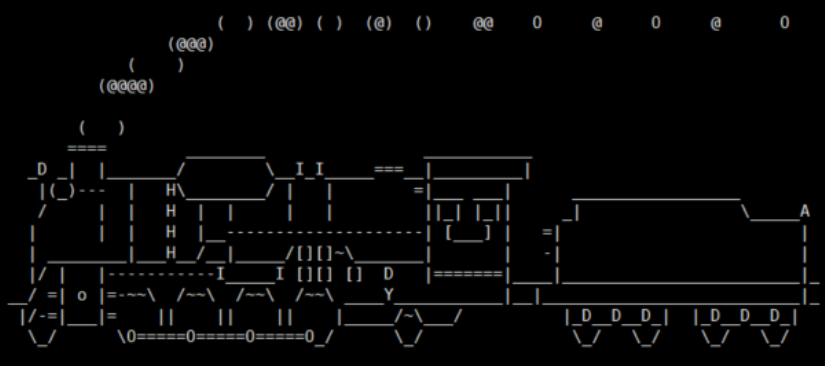
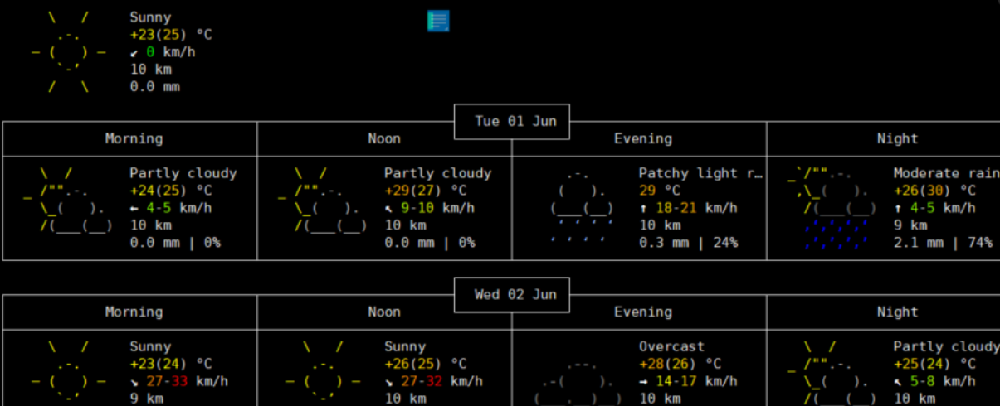
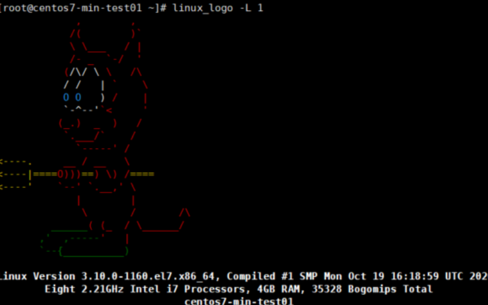
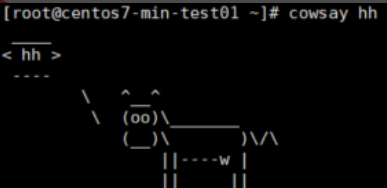

## 一些有趣的linux命令

1. #### 蒸汽小火车 

   ```
   yum install -y epel-release
   yum install -y sl
   sl
   ```

   

   ​	 子命令：

   ​        -a : 似乎发生了意外。你会为那些哭喊求助的人们感到难过。
   ​		-l : 显示小一点的火车
   ​		-F : 它居然飞走了
   ​		-e : 允许被 Ctrl+C 中断 

   

2. ####  天气预报  

   ```
   curl http://wttr.in
   ```

   

   

3. #### linux_logo 

   ```
   yum install -y linux_logo
   linux_logo -L 1   # 后面的数值范围为1到26
   ```

   

4. #### oneko 

   ```
   yum install cowsay -y
   ```

5. #### cowsay 

   ```
   yum install cowsay -y 
   cowsay hh
   ```

   

