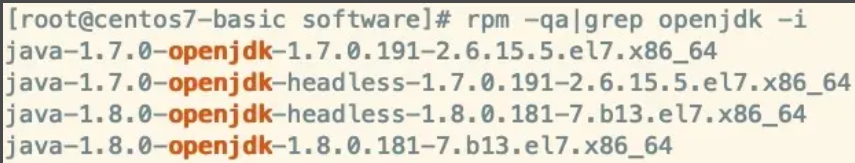
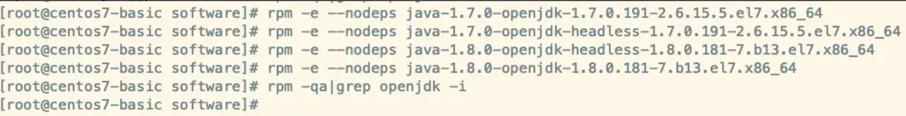
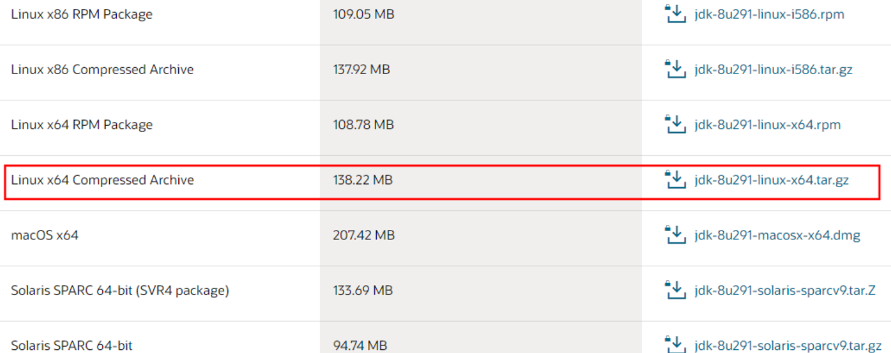
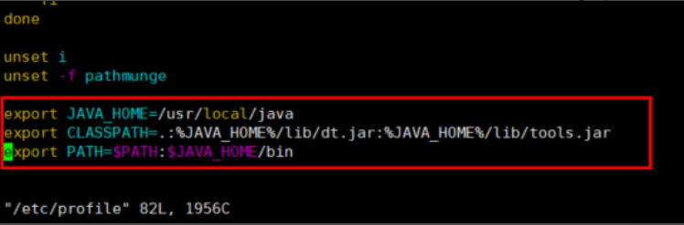

## Centos7安装Jdk1.8

1. #### 查看是否有默认openJdk，有的话卸载 

   ```
   rpm -qa|grep openjdk -i
   ```

   

   ```
   rpm -e --nodeps 需要删除的软件
   ```

   

   

2. ####   下载指定版本jdk

    下载地址： https://www.oracle.com/java/technologies/javase/javase-jdk8-downloads.html

   

   

3. ###   rz上传服务器

   ```
   mkdir /opt/software
   rz -y  #如果没有rz命令 先 yum install lrzsz 安装
   ```

   

4. ###   解压移动到指定目录

   ```
   tar -zxvf  /opt/software/jdk-8u291-linux-x64.tar.gz
   mv /opt/software/jdk1.8.0_291 /usr/local/java   #注意路径最后都没有斜杠/
   ls /usr/local/java
   ```

   

5. ###  修改profile

   ```
   vim /etc/profile 
   ```

   末尾添加：

   ```
   export JAVA_HOME=/usr/local/javaexport CLASSPATH=.:%JAVA_HOME%/lib/dt.jar:%JAVA_HOME%/lib/tools.jarexport PATH=$PATH:$JAVA_HOME/bin
   ```

   

   ```
   source  /etc/profile 
   ```

6. ### 验证

   ```
   java -version
   java
   javac
   ```