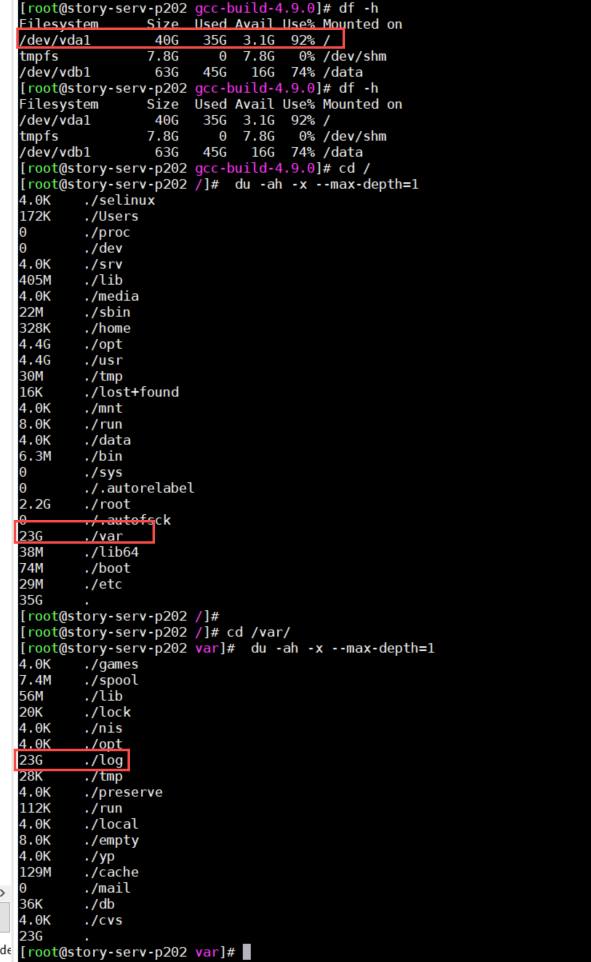

磁盘占用百分百处理

```
df -h
cd /
du -ah -x --max-depth=1
```



找到大文件夹 一步步进入，最终定位大文件 删除

```
rm  -f  xxxxx
```


可能的异常

在清理过服务器上一个高达 17 多 G 的文件后，使用 `df -h` 查看存储空间仍然 100%。使用 `du -h -x --max-depth=1` 进行查看与 `df -h` 的结果不一致。


解决方案：使用 `lsof |grep deleted` 进行查看是否有删除操作的异常进程

```
lsof |grep deleted
```

kill -9 xxx后


df -h正常

