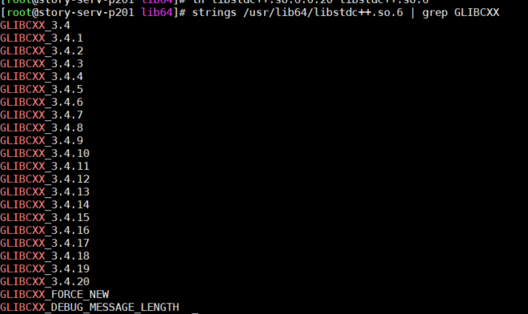

## Node部署 (Centos6)

#### 二进制方式 安装

```
mkdir /opt/software/node

cd /opt/software/node
```

查看版本：https://nodejs.org/dist


```
wget https://nodejs.org/dist/v16.3.0/node-v16.3.0-linux-x64.tar.xz   

tar xvf node-v16.3.0-linux-x64.tar.xz

ln -s /opt/software/node/node-v16.3.0-linux-x64/bin/node /usr/local/bin/node

ln -s /opt/software/node/node-v16.3.0-linux-x64/bin/npm /usr/local/bin/npm

node -v

npm -v
```


#### 错误处理1


查看系统中可使用的glibc版本

```
strings /lib64/libc.so.6 | grep GLIBC_

```


下载版本的glibc库

1.由上图可知，并没有GLIBC_2.17版本的glibc库，所以我们要下载2.17版本的库，从这下载 [glibc-2.17.tar.gz](https://ftp.gnu.org/gnu/glibc/glibc-2.17.tar.gz)，也可下载[更多版本](https://ftp.gnu.org/gnu/glibc/) 

下载解压缩

```
wget https://ftp.gnu.org/gnu/glibc/glibc-2.17.tar.gz

tar -xvf glibc-2.17.tar.gz
```

编译安装

进入glibc-2.17目录中，创建build目录

```
cd glibc-2.17 

mkdir build
```

进入build目录中，执行./configure

```
cd build

../configure --prefix=/usr --disable-profile --enable-add-ons --with-headers=/usr/include --with-binutils=/usr/bin

```


安装

```
make && make install
```

查看共享库

```rust
ls -l /lib64/libc.so.6

//可以看到已经建立了软链接
lrwxrwxrwx. 1 root root 12 Jan 13 01:49 /lib64/libc.so.6 -> libc-2.17.so
```

再次查看系统中可使用的glibc版本

```ruby
strings /lib64/libc.so.6 |grep GLIBC_
```


#### 错误处理2


查看版本

```
 strings /usr/lib64/libstdc++.so.6  | grep GLIBCXX
```


下载解压新版本

```
wget http://ftp.gnu.org/gnu/gcc/gcc-4.9.0/gcc-4.9.0.tar.bz2

tar -jxvf gcc-4.9.0.tar.bz2

cd gcc-4.9.0

./contrib/download_prerequisites
```

long long time after ......

建立一个目录供编译出的文件存放

```
mkdir gcc-build-4.9.0

cd gcc-build-4.9.0
```

生成Makefile文件：

```
../configure -enable-checking=release -enable-languages=c,c++ -disable-multilib
```

 编译（注意：非常耗时，1个小时左右）

```
 make  -j4
```

安装

```
make install
```


```
find / -name "libstdc++.so*"
```

找到 /usr/local/lib64/libstdc++.so.6.0.20


删除以前的libstdc++.so.6链接

```
cd  /usr/lib64 

rm  -f libstdc++.so.6
```

建立软连接 

```
cp /usr/local/lib64/libstdc++.so.6.0.20 /usr/lib64

ln libstdc++.so.6.0.20 libstdc++.so.6 
```

验证对应的版本型号

```
strings /usr/lib64/libstdc++.so.6 | grep GLIBCXX
```



校验

```
node -v
npm -v
```


#### 运行node项目缺少依赖


安装依赖

```
npm install express

npm install express-generator
```


