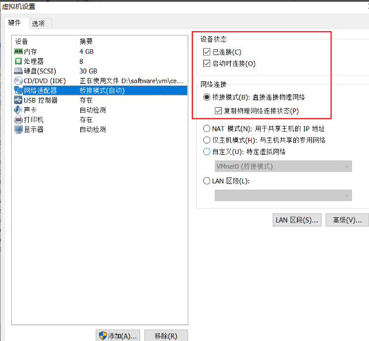
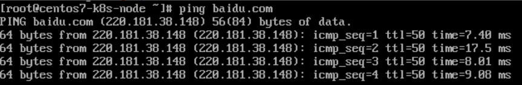

## 虚拟机中Centos7桥接网络配置

1. ### 虚拟机  编辑-虚拟网络编辑器  

   

     如上图选择桥接模式

     注意Vm虚拟机打开时候以管理员身份运行，否则可能看不到桥接

2. ####  虚拟机 设置-网络适配器 

   

3. ####  查看宿主机 网络状态 

     cmd 中 ipconfig /all

   

   

4. ####   进入 centos7中 

   ```
   vi /etc/sysconfig/network-scripts/ifcfg-ens33 
   ```

    

   注意：DOOTPROTO=static # 静态IP
   IPADDR=192.168.0.93   #需要和设置的IP段统一，可以随便设置，不和其它机器重复就行
   NETMASK=255.255.255.0 # 子网掩码 和 宿主机一致
   GATEWAY=192.168.2.1 网关 和宿主机一致
   DNS1=8.8.8.8  #和宿主机一致 这个必须设置 否则会导致能ping通外部IP，ping不通域名
   \# 注意：写你的DNS,如果没有就写公网的8888或者114.114.114.114   

   

   ```
   systenctl stop firewalld  
   service network restart
   ping baidu.com
   ```

    